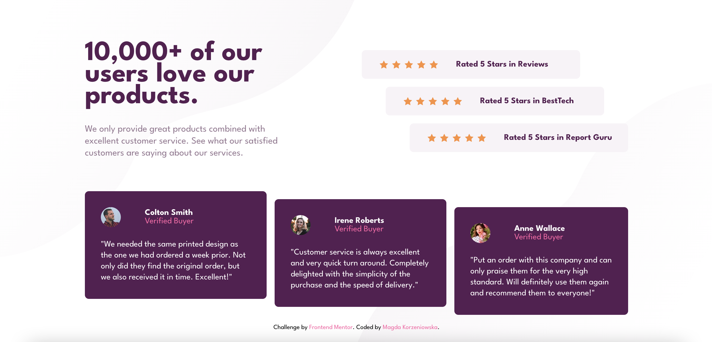

# Social Proof Section Challenge

This is a solution to the [Social Proof Section challenge on Frontend Mentor](https://www.frontendmentor.io/challenges/social-proof-section-6e0qTv_bA). Frontend Mentor challenges help you improve your coding skills by building realistic projects.

### [Live](https://social-proof-section-frontmr.netlify.app/) | [Solution](https://www.frontendmentor.io/solutions/mobilefirst-solution-using-sass-flexbox-and-grid-aY26iUEnT5) | [Challenge](https://www.frontendmentor.io/challenges/social-proof-section-6e0qTv_bA)

## Table of contents

- [Overview](#overview)
  - [Screenshot](#screenshot)
- [Installation](#installation)
- [Built with](#built-with)

## Overview

### Screenshot



## Installation

1. Start terminal and clone repository using:

   ```bash
   git clone https://github.com/magda-korzeniowska/social-proof-section-frontendmentor.git
   ```

2. Install all dependencies => go the main directory of the react-challenge repository:

   ```bash
   cd social-proof-section-frontendmentor
   ```

   and run:

   ```bash
   npm install
   ```

3. Run application:

   ```bash
   npm start
   ```

4. After running npm start, the website should open automatically in your browser. If it doesn't, open [http://localhost:3000](http://localhost:3000) in your browser.

## Built with

- Semantic HTML5 markup
- CSS custom properties
- Sass
- Flexbox
- CSS Grid
- Mobile-first workflow
